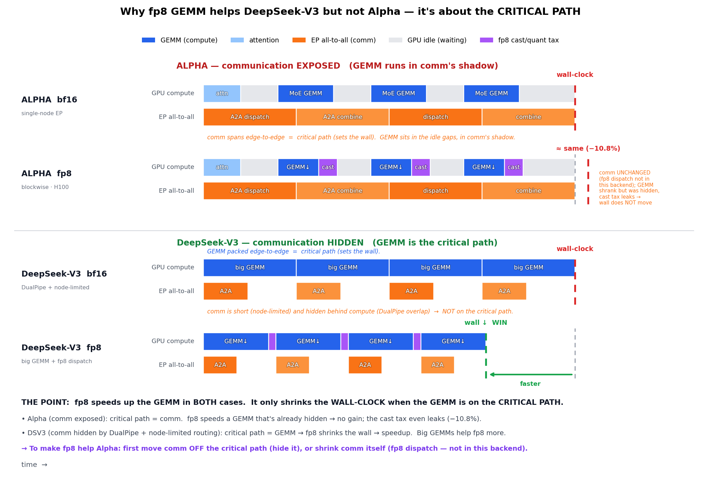
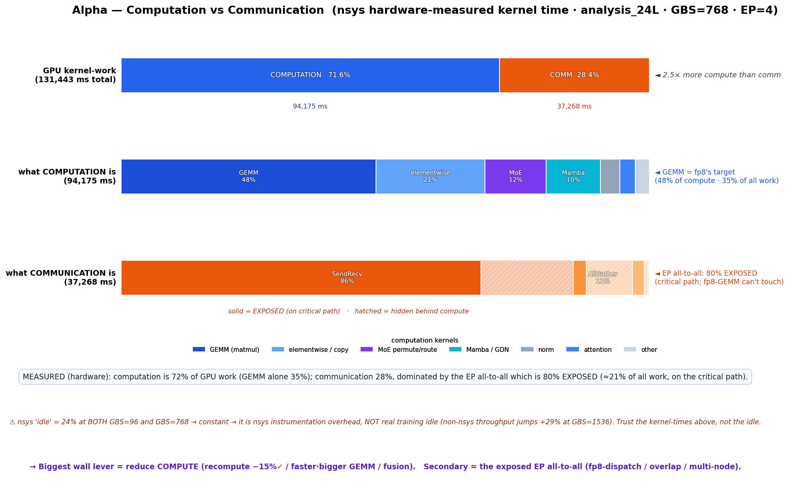
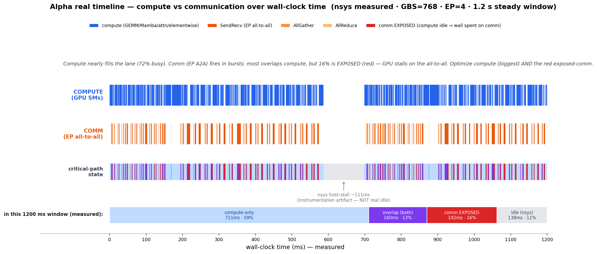
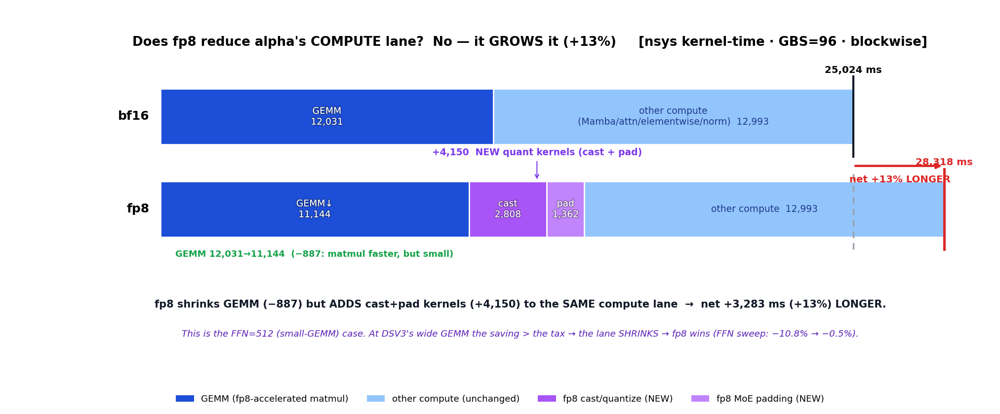

# Alpha Training Throughput Optimization Guide

Working reference for diagnosing and applying throughput optimizations to the
live **Stage-1 `baseline_48L`** pre-training run, validated on the H100×4
analysis node before touching the H100×8 training node.

- **How to profile**: [`configs/training/profile.yaml`](../configs/training/profile.yaml) + `NSYS=1` (see [Methodology](#methodology)).
- **How to analyze**: [`tools/analyze_nsys_trace.py`](../tools/analyze_nsys_trace.py).
- **Env requirement** of the analysis node: pinned triton/mamba/fla stack (memory `debug-node-pinned-versions`).

---

## TL;DR — prioritized levers

Measured on `analysis_24L` (24L, EP=4) — a half-depth twin of `baseline_48L`.
**Read the [GBS-scaling caveat](#methodology-caveat-gbs-invariant-costs) first**:
per-token costs (comm, GEMM, recompute) transfer to production by *fraction*;
per-step costs (the optimizer) are inflated ~8× here by the small analysis GBS.

| # | Lever | Evidence | Prod-relevant? | Mid-training safety |
|---|---|---|---|---|
| 1 | **Raise `CUDA_DEVICE_MAX_CONNECTIONS` 1→8** | A/B: **+2.7%**, bit-identical | ✅ per-token, holds | ✅ **SAFE anytime** — scheduling only |
| 2 | **Reduce `recompute-modules`** (`"layernorm moe"`→`layernorm`) | A/B (2026-06-10): **+15.2%** (133.9→154.3 TFLOP/s), costs +9.4 GB | ✅ per-token; **verify prod 48L memory first** (~2× activations → est. +19 GB) | ✅ **SAFE anytime** — same math (bitwise drift from nondeterministic MoE kernels only) |
| — | ~~**fp8 compute**~~ (blockwise/tensorwise) | A/B (2026-06-30): at **prod GBS=1536 blockwise −10.8%** (GBS=96 looked −1.2% only because 23% idle hid the overhead); tensorwise −16%. fp8 GEMM *is* faster but quant overhead exceeds it — see [fp8 detail](#fp8-compute----fp8-format-hybrid-tested--rejected-2026-06-30) | ❌ **rejected** | — |
| 4 | `micro-batch-size` 3→6 | ½ the A2A dispatches (reduces comm, not hides it) | ✅ structural | ⚠️ **Validate** — OOM + loss-continuity (GBS unchanged) |
| 5 | ~~Muon launch-bound → CUDA Graphs~~ | analysis: 124k kernels, 44% idle. **But optimizer is GBS-invariant → ~1.6% on prod** (NVIDIA: opt = 1–3% of a real step) | ❌ **deflated**: ~1% on prod, not worth new code | ✅ (graph = identical numerics) |
| — | ~~`moe-shared-expert-overlap`~~ | A/B: **net ~0** even at conn=8 (see [results](#ab-results-validated-2026-06-09)) | ❌ rejected | — |
| — | ~~**FA3 attention backend**~~ | A/B (2026-07-02): **−1.8% at prod GBS** vs fused-noclip; kernels −8%/call but attention is only ~1.8% of wall → ceiling +0.15%; **requires dropping QK-Clip** (TE: max_logit ⇒ fused-only). See [FA3 detail](#fa3-attention-backend----attention-backend-flash--flashattention-3-tested--rejected-2026-07-02) | ❌ **rejected** | — |
| — | ~~layer-scope CUDA Graphs (`--cuda-graph-impl transformer_engine`)~~ | all 4 scope combos fail or regress (see [CUDA-graph A/B](#cuda-graph-ab-tested--rejected-2026-06-10)) | ❌ rejected on alpha | — |

> **Revised twice (2026-06-09).** (1) The "20% *exposed* A2A is recoverable by
> overlap" hypothesis was **tested and disproven** — the A2A is largely
> *structural* (critical-path dispatch→GEMM→combine). (2) The "Muon launch-bound
> tail is the biggest cheap win" claim was **corrected** — the optimizer is
> GBS-invariant, so the analysis model's tiny GBS (96 vs prod 1536) inflated its
> apparent share ~8×; on production it is ~1–1.6%. The robust cheap wins are
> **conn=8 (free) and recompute reduction (attacks the 51% backward phase)**.

## A/B results (validated 2026-06-09)

`analysis_24L`, EP=4, mock, 20 iters (throughput = untraced; exposure = nsys):

| condition | throughput | Δ | SendRecv exposed | comm-only(wall) | GPU idle |
|---|---|---|---|---|---|
| A `conn=1, overlap=off` (baseline) | 130.8 TFLOP/s | — | 76% | 20.1% | 16.9% |
| B `conn=8, overlap=off` | **134.3** | **+2.7%** | — | — | — |
| C `conn=8, overlap=ON` | 131.6 | +0.6% | **58%** | 17.0% | 16.9% |

Reading: enabling overlap (A→C) **did** hide A2A (SendRecv 76%→58% exposed,
hidden comm 11%→15%), but throughput stayed flat because (a) only ~167 ms wall
moved — most A2A is on the critical path, (b) the shared expert (intermediate
512) is too small to hide more, (c) per-MoE-layer cross-stream barriers offset
the gain (C < B), and (d) **GPU idle (16.9%) is unchanged**. Net: **adopt conn=8,
skip shared-expert-overlap.** (The GPU idle is dominated by the Muon tail, which
looks large here but is a small-GBS artifact — see the caveat below.)

Reproduce: `CUDA_DEVICE_MAX_CONNECTIONS=8 bash train.sh analysis_24L profile mock --train-iters 20`
(throughput) and add `NSYS=1 ... --moe-shared-expert-overlap --profile-step-start 6
--profile-step-end 7` then `tools/analyze_nsys_trace.py` (exposure).

## Recompute + CUDA-graph A/B (2026-06-10)

`analysis_24L`, EP=4, mock, 20 iters, all at conn=8 (steady mean = last 15 iters):

| run | condition | throughput | Δ vs A | max alloc (rank 0) | outcome |
|---|---|---|---|---|---|
| A | stock (`recompute-modules "layernorm moe"`) | 133.9 TFLOP/s | — | 40.0 GB | baseline (reproduces 134.3 from 06-09) |
| B | `--recompute-modules layernorm` (**Lever 2**) | **154.3** | **+15.2%** | 49.4 GB (+9.4) | ✅ **ADOPT** (after prod memory check) |
| C | B + graphs `attn moe_router moe_preprocess` | — | — | OOM | ❌ graph private pools (+9.5 GB) on top of B blow 80 GB |
| C2 | A + graphs `attn moe_router moe_preprocess` | — | — | — | ❌ hard error: "moe_router cuda graph is not supported with moe recompute" (`transformer_config.py:1750`) |
| C3 | A + graphs `attn` | — | — | — | ❌ crash: alpha QK-Clip (`pretrain_alpha.py::_hybrid_clip_qk`) reads max-attention-logit stashed by the attn forward; under graph **replay the host-side stash never runs** → `all_reduce(None)` TypeError |
| C4 | A + graphs `mamba` (9 GDN layers) | 128.6 | **−4.0%** | 40.0 GB | ❌ capture *works* (fla/Triton OK, 0.54 s) but replay bookkeeping + static-buffer copies cost more than the saved launches |

### CUDA-graph A/B: tested & rejected (2026-06-10)

Motivated by NVIDIA's GB200 DSV3 recipe (`--cuda-graph-impl transformer_engine
--cuda-graph-scope attn moe_router moe_preprocess`). All four applicable scope
combinations fail or regress on alpha:

1. **MoE scopes are mutually exclusive with our `moe` recompute** (upstream
   ValueError) — and dropping `moe` recompute to allow them (run C) re-spends the
   +9.4 GB *and* adds ~9.5 GB of graph private pools → OOM. The two levers compete
   for the same memory, and Lever 2 wins on measured gain.
2. **`attn` scope breaks QK-Clip** — any model using `_hybrid_clip_qk`'s
   max-logit side-channel cannot graph the attention layers without reworking the
   logit plumbing into a static graph output. 3/24 layers of surface doesn't
   justify it.
3. **`mamba` scope is net-negative** — GDN's fla kernels are few-and-large per
   layer (little launch overhead to save), so graph overhead dominates: −4.0%.
4. Root cause vs GB200: their win condition (Grace CPU launch throughput vs
   Blackwell, MLA's many tiny kernels) doesn't hold on H100+x86 where our
   launch-bound share (non-optimizer idle ≲10%) is small and mostly outside the
   graphable scopes.

Caveat: C4's loss differs from A (1.86e-2 vs 1.59e-2 at iter 20) — **not**
evidence of replay corruption; `--te-rng-tracker` (auto-enabled by CUDA graphs)
changes the init RNG stream, so the trajectories diverge from init. Throughput
is the valid comparison.

---

## Methodology caveat: GBS-invariant costs

The analysis model uses **GBS=96** (8 microbatches); production uses **GBS=1536**
(64 microbatches). This distorts any **per-step** cost relative to **per-token**
cost — the single most important thing to correct for when reading these numbers.

| Cost type | Scales with | Examples | Fraction transfers to prod? |
|---|---|---|---|
| **per-token** | GBS × seq (microbatch count) | forward/backward GEMM, MoE A2A, permute, recompute, activation | ✅ yes — measure here, trust the fraction |
| **per-step** | parameter count only (GBS-invariant) | **optimizer step (Muon NS)**, grad clip, the all-gather of params | ❌ no — **inflated ~8× here** |

Worked example — the Muon optimizer: 722 ms on the analysis step (≈12%). But the
forward-backward does 8× more microbatches on production while the optimizer does
the *same* work, so its production share is ≈ 722 / (8×5400 + 722) ≈ **1.6%**
(matches NVIDIA's published "optimizer = 1–3% of a real step"). The analysis
model made it look like a top lever; it is not. **Rule: before promoting a lever,
classify it per-token vs per-step. Per-step levers measured on a small-GBS proxy
are over-weighted by roughly (prod_GBS / analysis_GBS).**

Batched Newton-Schulz (the obvious launch-bound fix) *does* exist in
`emerging_optimizers` 0.2.0 (`batched_newton_schulz_step` via `baddbmm`), but our
`muon.py` calls the 2D per-param path; given the ~1.6% prod share, wiring up the
batched path is not worth it. (MoE experts are stored as one concatenated
`weight1`/`weight2`, not per-expert, so there is no per-expert launch explosion to
collapse anyway.)

---

## Methodology

Reproduce the whole measurement on the 4-GPU node (real run untouched on 8-GPU):

```bash
cd examples/alpha

# 1. Capture a trace (heavy = 4 ranks/3 steps; light = 1 rank/1 step, easier).
NSYS=1 bash train.sh analysis_24L profile mock \
    --profile-ranks 0 --profile-step-start 6 --profile-step-end 7 --train-iters 9
#   -> outputs/<run>/logs/nsys_<run>.nsys-rep

# 2. Quantify what's optimizable (auto-exports .sqlite; needs nsys on PATH).
python3 tools/analyze_nsys_trace.py outputs/<run>/logs/nsys_<run>.nsys-rep
```

`analyze_nsys_trace.py` computes — via an interval **sweepline**, not GUI
eyeballing — the four numbers that decide optimizability:

1. **Wall-time coverage**: idle / compute-only / **comm-only (EXPOSED)** / hidden.
   `comm-only` is the wall time recoverable if comm were perfectly overlapped.
2. **Comm exposure by NCCL op** (SendRecv / AllReduce / AllGather).
3. **Kernel-size distribution** (the launch-bound tail).
4. **Optimizer NVTX range** idle (launch-bound waste in Muon).

Why not read per-stream busy from the GUI/SQL? CUPTI `streamId` collides across
CUDA contexts, so per-stream sums are unreliable (you'll see "228% of span").
Name-based comm/compute classification over kernel intervals is robust.

For the GUI timeline itself (overlap/sequencing, not aggregates): download the
`.nsys-rep` and open in Nsight Systems ≥ 2025.3. Use `Ctrl+F` to jump to a named
range (`ncclGroupEnd`, `Optimizer.step`) rather than hunting visually.

---

## Baseline measurement (analysis_24L, 1 step, rank 0, mock data)

```
# Wall-time coverage  (span = 6690 ms, 356,069 kernels)
  GPU idle (bubble)      1130 ms  (16.9%)   <- recoverable (Muon tail dominates)
  compute only           3473 ms  (51.9%)
  comm ONLY (EXPOSED)    1347 ms  (20.1%)   <- MOSTLY STRUCTURAL (A/B: only ~167ms moved)
  comm+compute (hidden)   740 ms  (11.1%)

# Communication by type     total     exposed
  SendRecv (EP all-to-all)  4526 ms   76% exposed   <- critical-path A2A (not cheaply overlappable)
  AllReduce (grad sync)     1001 ms   70% exposed
  AllGather (param/optim)    475 ms   26% exposed   (overlap working)

# Kernel-size: median 11 us, mean 52 us; 36% of 356k kernels are <10 us
#   -> launch-bound workload (tiny kernels dominate by count)

# Muon optimizer NVTX range: span 1090 ms, 124,347 kernels, 44% GPU-idle
#   -> launch-bound; CPU can't feed the Newton-Schulz tail (LEVER 1)
```

The original read of this — "20% exposed comm is recoverable" — was **tested and
mostly disproven** (see [A/B results](#ab-results-validated-2026-06-09)). The
exposed A2A is largely *structural* (critical-path dispatch→GEMM→combine). And the
GPU idle, while real (median kernel 11 us → launch-bound), is dominated by the
optimizer — a **per-step** cost that the small analysis GBS over-weights ~8× (see
[GBS caveat](#methodology-caveat-gbs-invariant-costs)). So the robust cheap wins
are the **per-token** levers below, not the comm/optimizer ones the raw trace
seemed to point at.

---

## Levers in detail

### `CUDA_DEVICE_MAX_CONNECTIONS` 1→8 (Lever 1 — free ~3%)
- **A/B verdict**: +2.7% throughput, bit-identical. The win comes from overlapping
  the *separable* comm (grad-reduce / optimizer all-gather), **not** the
  routed-expert A2A (which has a true dispatch→GEMM→combine dependency).
- **Safety**: scheduling only. TP=1/CP=1 → Megatron's `=1` requirement
  (`arguments.py` validate_args) does not apply. **Apply anytime.**

### Reduce `recompute-modules` (Lever 2 — VALIDATED +15.2%, 2026-06-10)
- **A/B verdict**: `--recompute-modules layernorm` (drop `moe`) gives
  **133.9 → 154.3 TFLOP/s (+15.2%)**, iter time 6030 → 5236 ms, at
  **+9.4 GB** max-allocated (40.0 → 49.4 GB; device usage 61/80 GB) on
  analysis_24L EP=4 MBS=3. By far the largest validated lever.
- **Prod caveat**: 48L has ~2× the MoE layers → expect roughly **+19 GB/rank**.
  Check the live run's memory log for headroom before adopting. If headroom is
  insufficient, keep `moe` in recompute-modules — do NOT shrink MBS to make room
  (that changes the training schedule).
- **Safety**: same math — loss diff vs baseline at iter 20 was 0.2% relative
  (nondeterministic MoE kernel ordering, not a numerics change) →
  **apply at next checkpoint resume**, verify loss continuity over ~50 iters.
- Note: EP=4 here means 48 experts/rank (2× prod MoE GEMM size), so the prod
  fraction may differ somewhat — re-measure `--log-throughput` on the 8-GPU run.

### Muon optimizer launch-bound (DEFLATED — per-step cost, ~1.6% on prod)
- **Symptom (analysis)**: Muon NVTX range 1090 ms, 124k kernels, 44% GPU-idle.
  Looks huge — but the optimizer is **GBS-invariant**; on production GBS it is
  ~1.6% of the step (NVIDIA: optimizer = 1–3% of a real step).
- **Verdict**: **not worth new code.** A batched Newton-Schulz path exists
  (`emerging_optimizers` 0.2.0 `batched_newton_schulz_step`), and CUDA-graphing the
  step is *possible* (the standard NS path is sync-free, TP=1 → no comm), but the
  prod payoff is ~1%. Skip unless the optimizer fraction is re-measured high at
  production GBS.

### fp8 compute — `--fp8-format hybrid` (TESTED & REJECTED, 2026-06-30)

3-way mock A/B on analysis_24L EP=4 conn=8, GDN (`M`) layers forced to bf16 (see
"FP8 GDN-exclusion" below). 20-iter steady mean (iters 2-9,14-20):

| recipe | throughput | vs bf16 | NaN | loss |
|---|---|---|---|---|
| baseline bf16 | 133.3 TFLOP/s | — | 0 | — |
| `--fp8-recipe blockwise` (DSV3) | 131.7 | **−1.2%** (neutral) | 0 | tracks bf16 |
| `--fp8-recipe tensorwise` | 111.9 | **−16.1%** (regression) | 0 | tracks bf16 |

**⚠️ The GBS=96 row is idle-distorted — at production GBS, fp8 regresses hard.**
GBS=96 has ~23% per-step host idle (see Caveats) that *hides* fp8's net compute
overhead. Re-run at **GBS=1536** (the live Stage-1 batch; 8→128 microbatches
amortizes that idle; still EP=4):

| GBS | baseline | fp8 blockwise | Δ |
|---|---|---|---|
| 96 (analysis) | 133.3 TFLOP/s | 131.7 | −1.2% (neutral — **idle hid the overhead**) |
| **1536 (prod)** | **171.3** (+29%, idle gone) | **152.8** | **−10.8% (clear regression)** |

At GBS=1536 the baseline is compute-bound (idle ≈ 0), so fp8's net +13% compute
kernel-time (cast_transpose + padding ≫ the GEMM saving) is no longer hidden →
**−10.8%**. This **worsens with GBS** (3072/6144 are even more compute-bound) and with
**EP=8** (24 vs 48 experts/rank → *smaller* per-rank MoE GEMMs → less fp8 benefit). So
the **production verdict is ≈ −11% or worse**, NOT the −1.2% the analysis scale showed.
**Lesson**: validate per-token levers at production GBS — the GBS-invariant idle can
mask *or* inflate them.

**Numerically safe** (0 NaN, loss tracks bf16) — the low-risk GDN-bf16 scoping works.
But **no throughput win**, and the nsys kernel breakdown shows precisely why (summed
kernel-time, rank-0 2-step capture):

| category | bf16 | blockwise | tensorwise |
|---|---|---|---|
| GEMM (`nvjet_*`) | 12031 ms | 11144 (−7%) | **9304 (−23%)** |
| fp8 cast/quant | 0 | +2808 (237k k) | +2416 (**711k k**) |
| pad / amax (in "other") | ~0 | +1362 | +2530 |
| comm (nccl) | 12209 | 11384 | **17004 (+39%)** |
| total kernels | 712k | 956k | **1667k** |
| span (wall, under nsys) | 14991 ms | 14511 | **20272 (+35%)** |

- **fp8 GEMM is genuinely faster** — bf16 `nvjet_ts*` → fp8 `nvjet_qq*` in the trace
  (−7% blockwise, −23% tensorwise). The problem is **not** the GEMM, it's the
  quantization machinery around it.
- **blockwise**: per-128-block `block_scaled_1d_cast_transpose` (+2808) + activation
  `multi_padding/unpadding` (+1342) ≈ **+4150 ms** cancels the −887 GEMM saving; the
  remainder hides behind the exposed EP A2A → **wall neutral**.
- **tensorwise**: faster GEMM, but per-tensor current-scaling **amax fires a launch
  storm** (712k→1.67M kernels), serializing amax→cast→GEMM so the SendRecv A2A spins
  waiting (**comm +39%, wall +35%**) → **−16% regression**.
- **Root cause**: at production GBS the wall is ≈ **60% compute-only + 25% exposed
  EP A2A + 15% overlapped** (the 23% idle is a small-GBS/host artifact that
  amortizes away — see Caveats). Compute *is* on the critical path — so the problem
  is **not** "GEMM is hidden". The problem is that fp8 at alpha's **FFN=512** GEMMs
  **adds** compute: the +13% cast-transpose tax exceeds the −7% GEMM saving (small
  GEMMs are below the fp8 break-even — see the FFN-width sweep below), so it moves
  the wall the *wrong* way. The ~25% exposed comm only *softens* it (absorbs some of
  the added fp8 kernels → +13% compute shows as −10.8% wall). **fp8 fails because it
  makes compute slower at small GEMMs — not because compute is off the critical
  path.**



  *Schematic (`make_fp8_critical_path_fig.py`): fp8 only shrinks the wall when what
  it speeds up is on the critical path. DSV3 hides comm (DualPipe + node-limited
  routing) so the big GEMM is the critical path → fp8 wins. The alpha panel
  emphasizes comm-exposure for contrast, but per the FFN sweep the **primary** reason
  is small-GEMM break-even (fp8 adds compute); alpha is actually compute-dominant.*

**Measured comm vs compute (nsys hardware kernel-time, analysis_24L GBS=768 EP=4):**
GPU kernel-work is **72% computation / 28% communication** (compute = 2.5× comm). GEMM
= 48% of compute = **35% of all work** (fp8's target). Comm is dominated by the **EP
all-to-all: 86% of comm, 80% EXPOSED** (≈21% of all work, on the critical path).
**⚠ nsys 'idle' (24%) is an instrumentation artifact** — it reads ~24% at *both* GBS=96
and GBS=768 (constant → not per-step host overhead), and non-nsys throughput jumps +29%
at GBS=1536, so real training idle is small. Trust the kernel-times, not the idle.



*Takeaway: alpha is **compute-dominant** → the biggest wall lever is reducing COMPUTE
(recompute −15% validated / faster·bigger GEMM / fusion). The exposed EP all-to-all
(~21% of work) is the secondary lever (fp8-dispatch / overlap / multi-node). Generated by
`make_alpha_comm_compute_fig.py`.*

**Real timeline (x = measured wall-clock ms, 1.2 s steady window):**



*In this measured window: compute-only **59%** + overlap **13%** = compute running 72% of
the time; comm EXPOSED **16%** (red — GPU stalls on the EP A2A); idle **11%** (nsys stall,
artifact). The blue compute lane is nearly continuous → the biggest wall chunk. Comm (orange)
fires in bursts that mostly overlap compute; only the red slivers are on the critical path.
→ reduce COMPUTE to shrink the 72%, reduce exposed A2A to shrink the 16%. Generated by
`make_alpha_timeline_fig.py`.*

**Does fp8 shrink the compute lane? No — it GROWS it (+13%):** the compute lane = *all
non-comm GPU kernels*, and fp8's `cast_transpose`/`pad` kernels run on the SMs too. fp8
shortens the GEMM sub-part (−887 ms) but adds the quant kernels (+4,150 ms) to the *same*
lane → **25,024 → 28,318 ms (+13% longer)**. This is why fp8 is a *compute regression* at
FFN=512 — fully consistent with the −10.8% wall. (At DSV3's wide GEMM the saving beats the
tax → the lane shrinks → fp8 wins; the FFN sweep is the crossover.)



*Generated by `make_fp8_compute_lane_fig.py`.*

**Verdict**: **rejected for single-node EP MoE training** at production GBS — blockwise
**−10.8%** at GBS=1536 (worse at higher GBS / EP=8), tensorwise −16%. Numerically safe,
so revisit only if the architecture moves to larger GEMMs (bigger MoE FFN / dense
layers) where GEMM becomes the bottleneck.

**When to revisit (quantified)**:
- **GEMM width sweep** (GBS=1536, MoE params held constant via `num_experts × FFN =
  const`, GDN bf16, only per-expert GEMM width varied) — fp8 improves monotonically
  toward break-even as the MoE GEMM widens:

  | experts × FFN | fp8 Δ |
  |---|---|
  | 192 × 512 (alpha actual) | **−10.8%** |
  | 96 × 1024 | −7.7% |
  | 48 × 2048 (DSV3 FFN-width) | **−0.5%** (≈break-even) |

  alpha's FFN=512 is **below** the fp8 break-even arithmetic intensity; DSV3's
  hidden=7168 / FFN=2048 is **above** it. fp8 viability is set by GEMM *width*, not
  param count. We only widened N (FFN); widening hidden=2048→7168 (DSV3) would push it
  clearly positive. → revisit fp8 if a future dimensioning widens FFN/hidden.
  (Note: FFN=2048 at the full 192 experts **OOMs** on the 4-GPU node — DSV3-width MoE
  needs more GPUs / EP.)
- **Fused quantization kernels** — our −10.8% is on the **UNFUSED** path (TE 2.9.0:
  `block_scaled_1d_cast_transpose` + `multi_padding` are *separate* kernels = the
  +4150 ms tax that dominates the loss). NVIDIA's CuTe **GroupGemm+Quantize** fusion
  ([blog](https://developer.nvidia.com/blog/boosting-moe-training-throughput-with-advanced-fusion-kernels/))
  folds the quantize into the GEMM epilogue, removing exactly that tax — which our
  nsys decomposition flags as the killer, so it could flip alpha's fp8 positive even
  at FFN=512. **Gated behind**: TE ≥2.15 (alpha 2.9.0), Megatron-Core ≥26.04 (alpha
  251125), and largely **Blackwell** — the demonstrated gains (GB200; kernel fwd 1.3×/
  bwd 2.1×; DSV3 +8% e2e) use **MXFP8, which is Blackwell-only**
  (`transformer_config.py:428` "'mxfp8' for Blackwell architecture only"; H100 stays on
  `blockwise`). **Do NOT upgrade now** — breaks the pinned GDN/Triton/mamba stack for an
  uncertain H100 gain. **Re-test fp8 on the fused path when alpha moves to Blackwell or
  TE≥2.15 / Megatron≥26.04**; first check whether the +4150 ms cast tax disappears.

**Gotchas found**:
- `--moe-router-padding-for-fp8` is **incompatible with `moe-router-fusion`**:
  `pad_routing_map()` modifies the TE fused router's saved `routing_map` in-place
  (`moe/moe_utils.py:522  routing_map[mask]=1`) → autograd "variable needed for
  gradient … modified by an inplace operation" crash at the first backward. **Drop
  the padding flag** (TE pads internally; router fusion preserved).
- **TE 2.14 is NOT required** for the low-risk path — TE 2.9.0 already supports
  blockwise (≥2.3.0dev0) + MoE fp8 grouped GEMM (≥1.11). TE 2.14 only buys the
  PR#4636 MoE-GEMM-fusion *extra* %.
- `--fp8-recipe delayed` cannot do per-layer bf16 (the GDN exclusion):
  `get_fp8_context` asserts it, and delayed also conflicts with `layernorm`
  recompute (`transformer_config.py:1195`). Use a non-delayed recipe.

### FP8 GDN-exclusion mechanism (`experiment/fp8-compute` branch)

A global `--fp8-format` quantizes the GatedDeltaNet `in_proj`/`out_proj` TE linears.
Alpha runs the **Pai custom GDN**, which (unlike upstream
`megatron/core/ssm/gated_delta_net.py`) has **no fp8 alignment guard** → SSM fp8 is
unproven. The low-risk path keeps the 18 `M` layers in bf16 via a monkey-patch in
`pretrain_alpha.py` that extends `megatron.core.fp8_utils.is_first_last_bf16_layer`
to also return True for `M` positions of `hybrid_override_pattern`. Confirm via the
startup log `[alpha-fp8] GDN/Mamba 'M' layers forced to bf16 under FP8: 9/24`.
Lives on the `experiment/fp8-compute` branch (**NOT merged** — fp8 not adopted).

### FA3 attention backend — `--attention-backend flash` + FlashAttention-3 (TESTED & REJECTED, 2026-07-02)

**Question**: production uses TE FusedAttention (cuDNN) — `attention-backend: auto`
resolves to fused because QK-Clip's `return_max_logit` hard-disables ALL flash
backends in TE 2.9 (`dot_product_attention/utils.py` "Filter: Return max_logit").
Does the Hopper-optimized FA3 beat cuDNN if we pay the price of turning QK-Clip off?

**Setup**: FA3 3.0.0b1 built at the TE-pinned commit `3ba6f82` (hopper/, sm90a,
bf16+hdim256 only) and injected via `PYTHONPATH` (NOT system-installed). New preset
`configs/training/profile_noclip.yaml` (= profile.yaml minus `qk-clip` /
`log-max-attention-logit`) because flash runs *cannot* keep them (TE filters flash
→ zero eligible backends → crash). Backend confirmed per run via
`NVTE_DEBUG=1 NVTE_DEBUG_LEVEL=2` ("Selected backend = ..."). Alpha geometry
(hdim_qk=hdim_v=256, GQA 16/2, causal, sbhd) passes TE's `_is_fa3_supported`.

**Wall-clock A/B** (`analysis_24L` EP=4, mock, median of steady-state iters):

| config | GBS=96 ms/iter (TFLOP/s) | GBS=1536 ms/iter (TFLOP/s) |
|---|---|---|
| fused + QK-Clip (**production**) | 6335 (127.3) | 74056 (174.1) |
| fused, no clip | 6249 (129.0) | **71714 (179.7)** |
| FA2 2.7.3, no clip | 6343 (127.1) | — |
| **FA3 3.0.0b1, no clip** | 6222 (129.6) | 73041 (176.4) |

- **FA3 vs fused (apples-to-apples, both no-clip): −1.8% at prod GBS** (+0.4% at
  GBS=96 = noise; the 23% small-GBS idle absorbs path overhead, same lesson as fp8).
- **Kernel-level truth (nsys, 3-iter window)**: FA3 core kernels ARE faster at this
  geometry — fwd 0.551 vs 0.657 ms (−16%), bwd 2.235 vs 2.600 ms (−14%) — but FA3's
  extra pre/postprocess kernels + TE-side sbhd layout conversions (+0.4 ms/call of
  `at::native` copies) eat it: per call-set 3.06 vs 3.34 ms (−8%). Total GPU kernel
  time is ~parity (FA3 −1.6%, mostly NCCL spin-wait noise); CUDA API launch/sync
  counts ~identical. The −1.8% wall is path overhead + run noise, not kernel speed.
- **Ceiling argument (why this can never win)**: attention is only **~1.8% of iter
  wall** on alpha (3/24 attention layers, hybrid GDN). Even a hypothetical *free*
  attention kernel gains ≤1.8%; the realistic −8%-per-call kernel edge is ≈ +0.15%
  wall — unmeasurable. FA3's Hopper advantage lives at hdim 64–128 dense-attention
  models, not alpha's 256-hdim 12.5%-attention hybrid.
- **Functional blocker regardless**: QK-Clip (Muon stabilizer) requires
  `return_max_logit` → fused-only in TE 2.9. Adopting FA3 = dropping QK-Clip.
- **Side finding worth knowing**: the QK-Clip + max-logit machinery itself costs
  **+3.3% at prod GBS** (74056 vs 71714; only +1.4% visible at GBS=96) and +7.4 GB
  max-alloc at GBS=96. That is the price of Muon stability — accepted, but now
  quantified. (If TE ever supports max_logit on flash backends, re-evaluate.)
- Numerics sanity: FA3 run healthy — loss at iter 16 3.1473 vs fused 3.1507
  (normal kernel-order drift, mock data, 0 NaN).

**Verdict: ❌ rejected.** No throughput upside (neutral→slightly negative), a hard
conflict with QK-Clip, plus a from-source build dependency. Artifacts:
`profile_noclip.yaml` (kept for future backend A/Bs), FA3 wheel build recipe in the
session notes; nothing system-wide was installed.

### `moe-shared-expert-overlap` (tested, NOT adopted here)
- **A/B verdict**: at conn=8 it **does** hide A2A (SendRecv 76%→58% exposed) but
  nets ~0 throughput — the ~167 ms wall saved is offset by per-MoE-layer
  cross-stream barriers (C < B). Confirms the `stage1_resume.yaml` revert was
  correct, and conn=8 does *not* rescue it on this config.
- **Caveat**: production EP=8 has ~2× the A2A volume and a different
  shared/routed-expert ratio — **re-test there before dismissing**.

### `AllReduce` grad-sync overlap (secondary)
- **Symptom**: AllReduce 70% exposed while AllGather (distributed-optimizer) is
  only 26% exposed — so bucketed overlap works for the optimizer all-gather but
  the gradient all-reduce is left on the critical path.
- **Direction**: confirm in the timeline whether the exposed AllReduce is the
  small layernorm/embedding grad all-reduces (serial by nature) or the main
  bucketed reduce; tune `--overlap-grad-reduce` bucketing if the latter.

---

## Mid-training application protocol

Stage-1 `baseline_48L` is live. Apply optimizations in this order, smallest blast
radius first:

1. **Classify the change** (see TL;DR table):
   - ✅ *Scheduling/throughput-only* (CUDA_DEVICE_MAX_CONNECTIONS, CUDA graphs,
     shared-expert-overlap, attention backend, overlap flags, recompute modules):
     numerically neutral → **safe to apply at the next checkpoint resume**, no
     stage boundary needed. Loss curve must be continuous across the resume.
   - ⚠️ *Dynamics-changing* (muon-num-ns-steps, MBS, LR, optimizer hyperparams):
     **defer to a stage boundary** — same precedent as the Muon QGKV fix
     ("prefer a stage boundary for adoption", root `CLAUDE.md`).
2. **A/B on the 4-GPU node first**: capture a trace before and after, run
   `analyze_nsys_trace.py` on both, compare `comm ONLY` + `GPU idle`. Only promote
   changes that move those numbers.
3. **Promote to the 8-GPU run at a checkpoint resume**: edit the training preset,
   resume from the latest checkpoint, and verify the first ~50 iters' `throughput
   per GPU (TFLOP/s/GPU)` (from `--log-throughput`) improved and loss is continuous.
4. **Rollback** = resume the same checkpoint with the flag reverted; throughput
   flags carry no optimizer-state dependency.

> Throughput knobs that are scheduling-only do **not** require `--no-load-optim`
> or a fresh schedule — they change *how* the same math is executed, not the math.

---

## Caveats

- **nsys overhead**: tracing inflates the step (~5.7 s → ~6.7 s here) and can make
  comm look slightly more exposed. Trust the **lever ranking**; confirm absolute
  gains with `--log-throughput` A/B on an untraced run.
- **4-GPU vs 8-GPU**: per-GPU kernel/launch behavior (Muon tail, grouped-GEMM,
  permute, exposure *mechanism*) transfers. Absolute A2A/grad-sync **volume**
  differs (EP=4 vs 8, DP=4 vs 8). Under EP=4 there are 48 experts/rank vs 24 in
  production, so MoE GEMMs here are ~2× the prod per-rank size.
- **Analysis model**: `analysis_24L` + mock data exercises the same kernels; loss
  values are meaningless (mock data memorizes instantly).
- **GPU idle ≠ structural inefficiency**: the ~23% idle in these traces is **83%
  per-step host overhead** (inter-iteration Python loop / dataloader / host-blocking
  syncs — the largest single ~965 ms gap contained only ~1.4 ms of CUDA API, the rest
  pure CPU), **not** the launch-bound tiny-kernel tail (<20 µs gaps = only 23% of
  idle) and **not** a GEMM/comm cost. Like the optimizer it is **GBS-invariant** —
  inflated by nsys *and* by the tiny analysis GBS (96 vs prod 1536), so it amortizes
  away on production. No GEMM/fp8 lever touches it; if it must be attacked, the
  targets are host-side (dataloader prefetch, removing per-step `.item()` syncs such
  as the QK-Clip max-logit stash).

## Related
- Profiling setup & artifacts: memory `alpha-4gpu-profiling-setup`.
- Env pins required to run alpha here: memory `debug-node-pinned-versions`.
- Custom training features (step-GBS, progressive blend, Muon QGKV): root `CLAUDE.md`.
